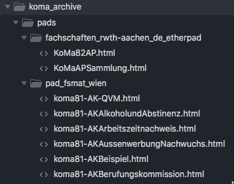

# Koma Etherpad Archiver
Das Skript `archive_etherpads.py` geht von einem Etherpad aus und verfolgt alle Links auf andere Pads und speichert diese. Dabei wird ein Ordner pads angelegt, der für jeden server einen Unterordner enthält, der wiederum die Pads selber als HTML Dateien abspeichert, vergleiche folgendes Beispiel:

Weiter wird eine CSV mit den beobachteten gerichteten Kanten (von Pad ausgehende Links) abgespeichert.

*** 

__Disclaimer__: Das ist ganz und gar nicht ausgereift, noch durchdacht, noch getestet. Benutzung auf eigene Gefahr. Anpassen erwünscht. Fragen auch erwünscht.

***

# Usage
Ebenfalls möglich: aus IPython heraus

    from archive_etherpads import PadGrabber
    pads = PadGrabber("https://fachschaften.rwth-aachen.de/etherpad/p/DEMOPAD")
    pads.follow_links(pads.base_url)
    edges = pd.DataFrame(pads.edges, columns=['from', 'to'])
    edges.to_csv("pads/edges.csv", encoding='utf-8')

